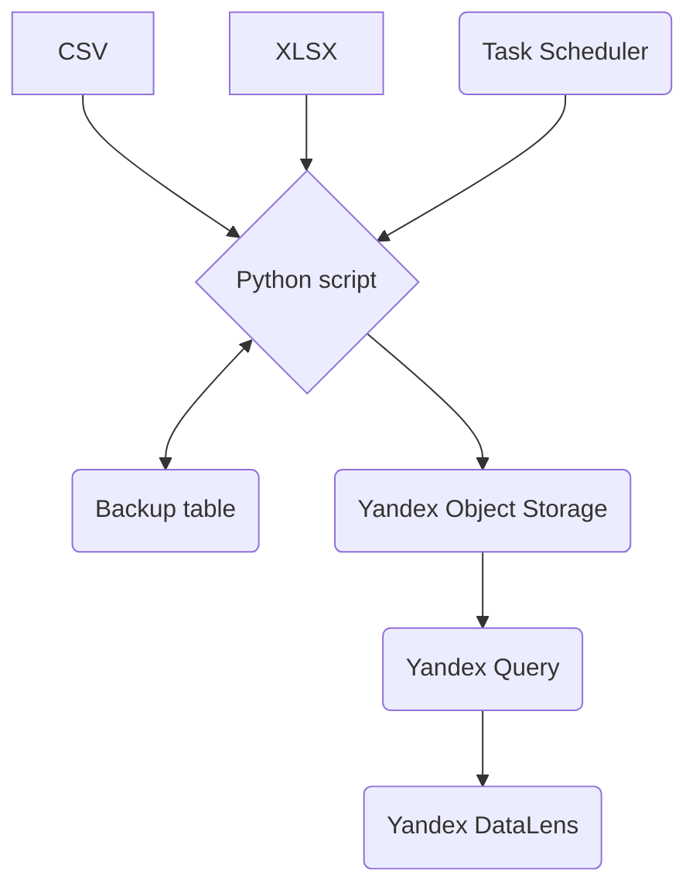

# Проект Свободный CSV
## Цель: Создать архитектуру для удобного бесплатного использования CSV в Yandex DataLens

Предварительная схема

Материалы:

* [Визуализация данных из Yandex Object Storage на дашбордах Yandex DataLens](https://cloud.yandex.ru/docs/query/tutorials/datalens)
* [Yandex Object Storage](https://cloud.yandex.ru/docs/storage/)
* [Yandex Query](https://cloud.yandex.ru/services/query)
* [Yandex DataLens](https://cloud.yandex.ru/docs/datalens/)

По стоимости сервисов Yandex:

[Уровень нетарифицируемого использования (free tier) для сервисов экосистемы бессерверных вычислений](https://cloud.yandex.ru/docs/billing/concepts/serverless-free-tier)
