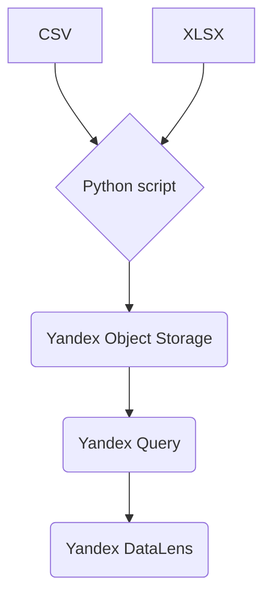

# Проект Свободный CSV
## Цель: Создать архитектуру для удобного бесплатного использования CSV в Yandex DataLens

Предварительная схема

```mermaid
graph TD;
    A[CSV]-->C{Python script};
    B[XLSX]-->C{Python script};
    C{Python script}-->D(Yandex Object Storage);
    D(Yandex Object Storage)-->E(Yandex Query);
    E(Yandex Query)-->F(Yandex DataLens);
```
