# Простые подключения к Yandex.Cloud Datalens
## Две таблицы из Google Sheets (Гугл Таблиц) через CSV. Публичный доступ к дашборду из Google Sheets.
В подключении Datalens `Google Sheets` можно подключить только один лист из Таблиц. Но что делать, если надо две или более таблиц, которые связаны друг с другом по отдельным полям. Очевидно, что заполнять одну большую таблицу. Но бывает, что таблицы заполняются автоматически, например CRM, или их ведет другой отдел, или сотрудники, которым "вот так удобно". Или нужен публичный доступ к дашборду. Datalens отключили материлиазацию и для подключения `Google Sheets` публичный доступ недоступен. В общем, будем справляться сами, разработчикам не до нашей песочницы с 500 000 строками таблиц в Google Sheets, мы, если по футбольному, Первая лига. Поймите их правильно, такие объемы для баз данных это ерунда, они работают в основном на подключение к большим базам данных. Но мы как-нибудь потом попробуем с нашими Google Sheets влезть в высшую лигу.
Что делать, работаем через подключение `File` то есть CSV. Трудозатратнее, обновление вручную, но больше возможностей.
- можем склеивать\джойнить несколько листов из Таблиц, даже из разных документов;
- полученный дашборд можно сделать публичным;
- остается возможность обновления данных вручную.

Давайте рассмотрим простой пример работы с Google Sheets через CSV. Есть Таблица с двумя листами.

Первый лист таблицы с основными показателями.

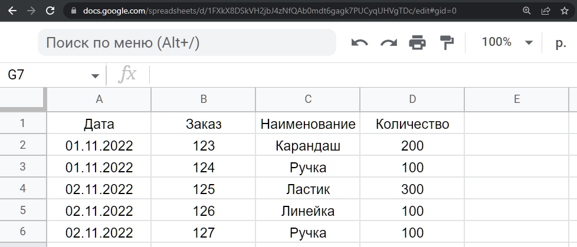

Вторая лист таблицы, в которой нас интересует колонка **Стоимость**

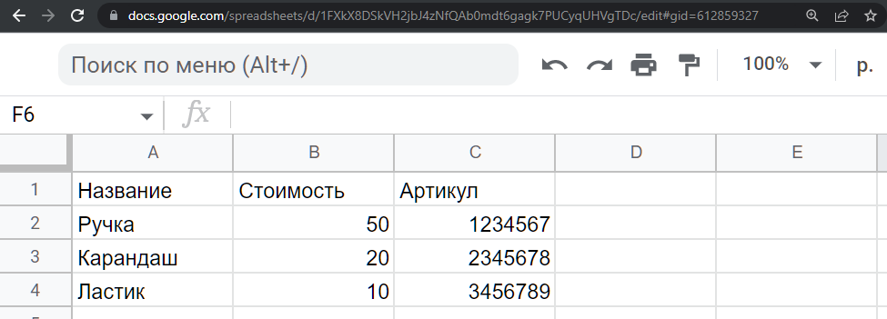

Как видно, две таблицы объединяют колонки **Наименование** и **Название**. Названия разные, но данные в них одинаковые. Главное найти колонки с идентичными данными в двух таблицах и желательно, чтобы во второй таблице эти значения были уникальными. Например, если во второй таблице **Карандаш** в одной строке будет стоить 20, а в другой строке **Карандаш** будет стоить 15, будут неверно объединены таблицы, так как программа не смотрит на другие данные. В таких случаях надо сделать уникальные названия, например второй **Карандаш** переименовать в **Карандаш эконом**. Но это делать надо до начала экспорта в Datalens.

Продолжаем. Экспортируем каждый лист в формате CSV на свой жесткий диск.

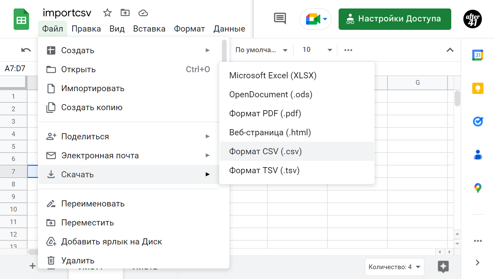

`Файл` -> `Скачать` -> `Формат CSV (.csv)`. В диалоговом окне сохраняем на жесткий диск.

Переходим на [Datalens](https://datalens.yandex.ru).

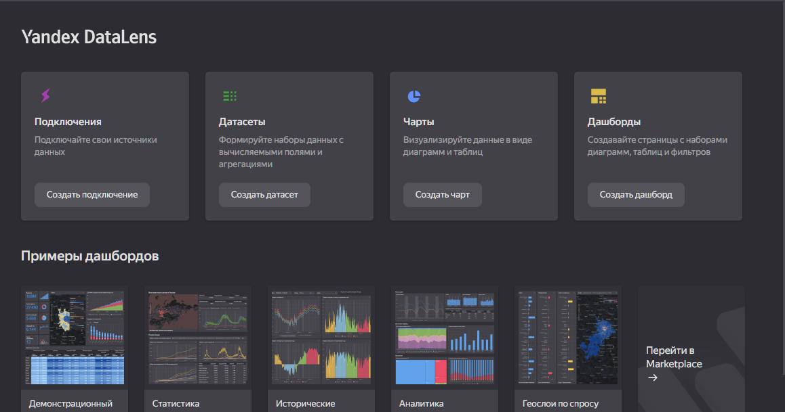

Выбираем `Создать подключение`

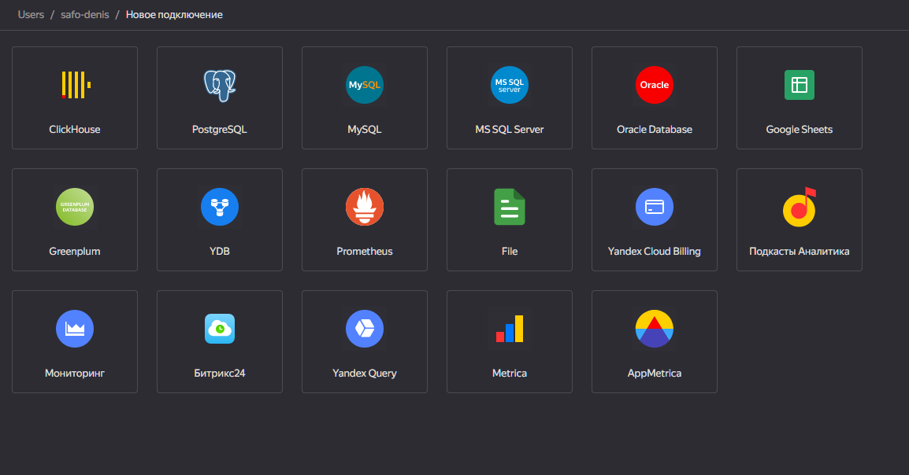

Выбираем `File`

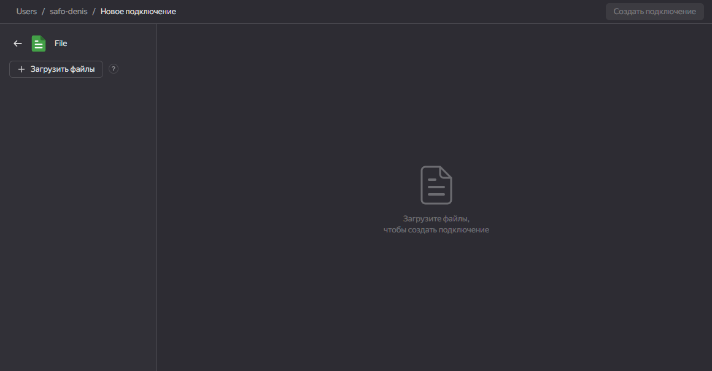

Нажимем `+ Загрузить файлы`. В диалоговом окне выбираем файлы, которые мы скачали с Таблиц, можно все сразу выделить и загрузить.

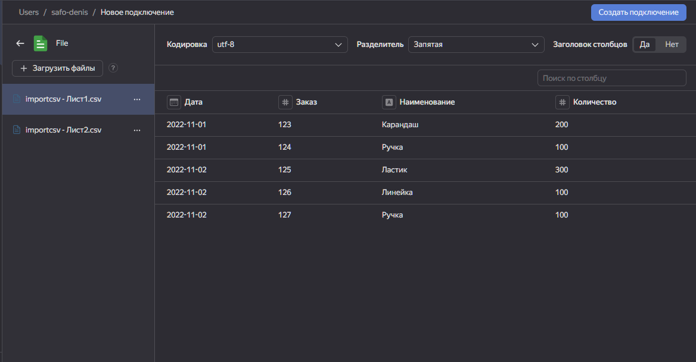

Итак, наши файлы загрузились, выбирая их в левом столбце, в правом можно посмотреть их содержимое (на предпросмотре все строки не загружаются, только часть!). Типы значенй в столбцах определились правильно, то есть колонка **Дата** как дата (пиктограмма календарика), **Заказ** и **Количество** как числа (пиктограмма решетки), Наименование как строковое значение (пиктограмма А). Если тип определен неправильно, можно нажать пиктограмму и изменить его. Но в первую очередь это значит, что где-то в данных есть значение другого типа. Например, в столбце **Количество**, в одной строке вместо **0** внесено буквами **ноль**. Тогда интерпритатор весь столбец обозначит как строковый. Такие вещи надо править непосредственно в Google Sheets.

Нажимаем на `Создать подключение` в правом верхнем углу.

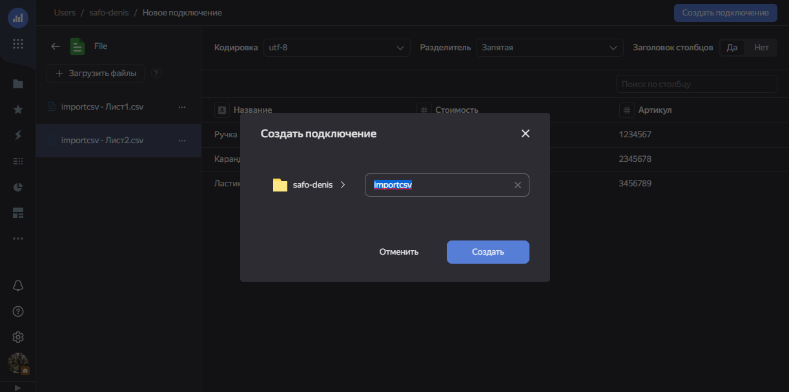

Вводим название нашего подключения. Важно помнить, что одинаковых имен быть не должно. То есть, нельзя назвать Подключение, Датасет, Чарт и Дашборд одним именем, будет всплывать ошибка. Добавляйте префиксы к названию: **MyBIproject_connection, MyBIproject-DataSet, mybiproject_chart_gain, etc**. Можно выбрать папку, куда все добро сохранять, нажав на значок `>`

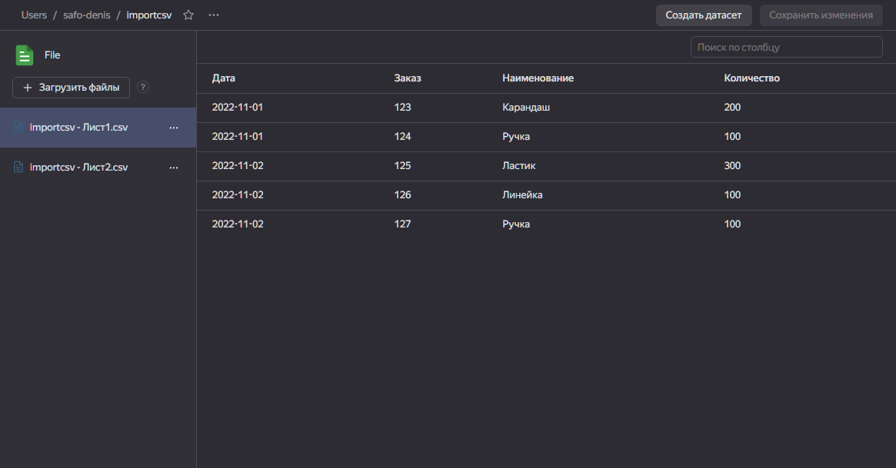

Нажимаем `Создать датасет` в правом верхнем углу.

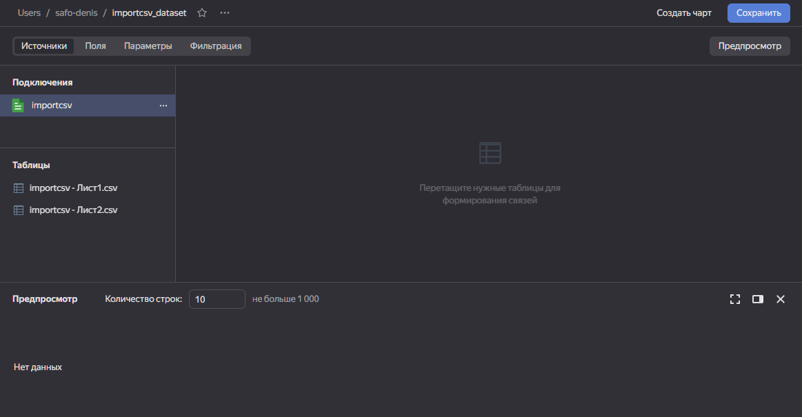

Перетаскиваем наши листы из левой колонки `Таблицы` в правое пустое поле.

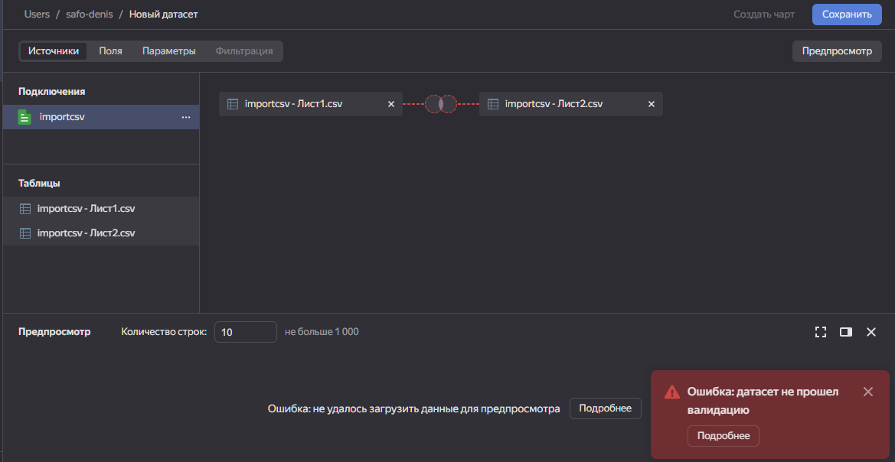

Получаем сообщение об ошибке `Датасет не прошел валидацию`. Это произошло потому, что Datalens не нашел колонок с ОДИНАКОВЫМ названием. Как мы помним, у нас идентичные колонки называются **Наименование** и **Название**. Давайте исправим это. Нажимаем на сдвоенный красный кружок в правом поле.

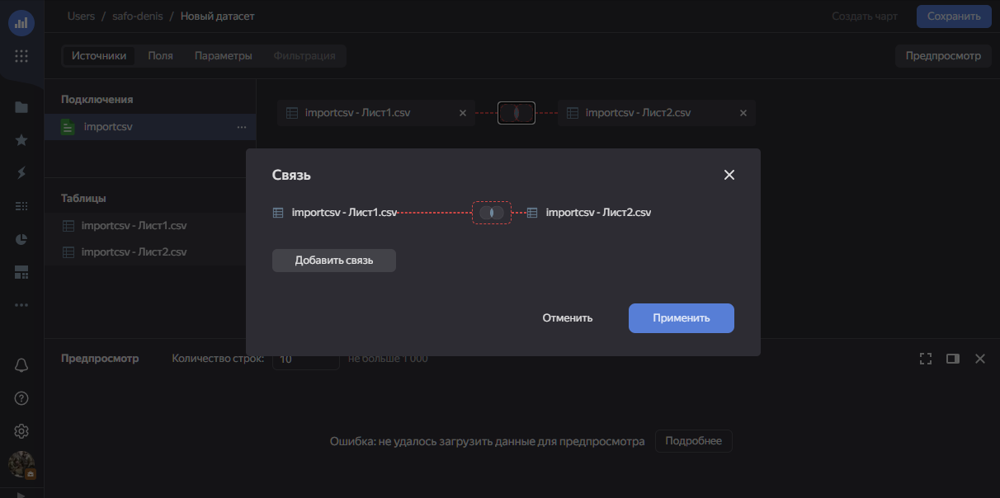

Открывается диалог связей между нашими листами. Нажимаем на `Добавить связь`.

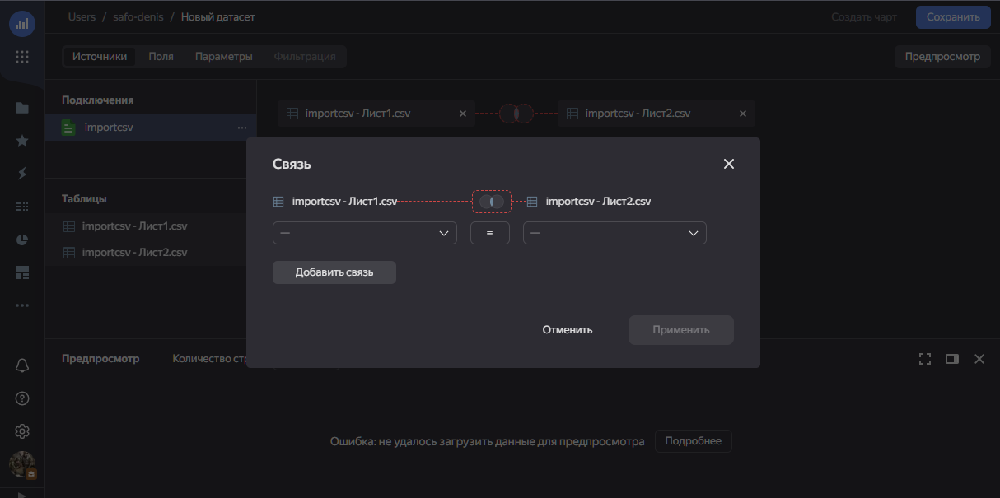

Появятся селекторы с выпадающим списком полей в наших листах. Выбираем соответственно **Наименование** и **Название**.

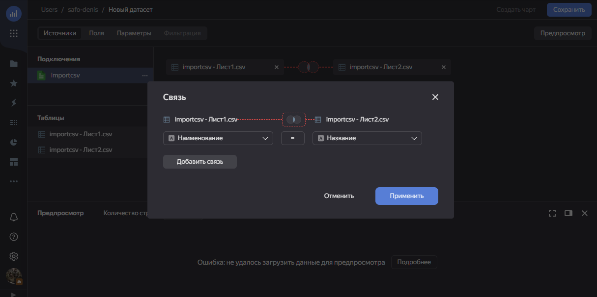

Нажимаем на `Применить`.

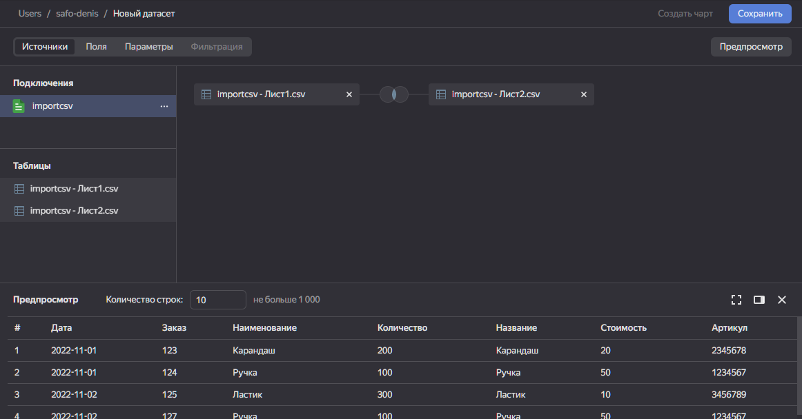

Чудо свершилось! Мы подружили два наших листа. Внизу страницы, в `Предпросмотре`, мы видим новую объединенную таблицу. Нажимаем в левом верхнем углу селектор `Поля`.

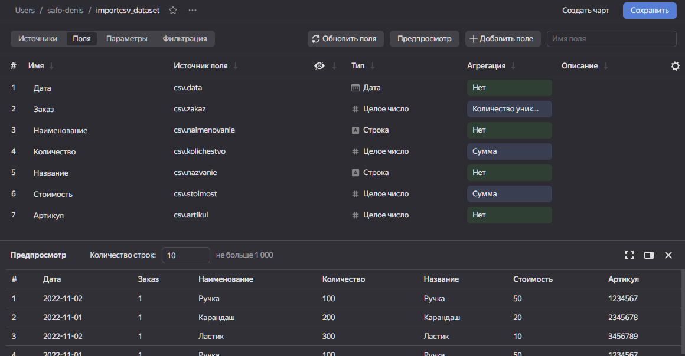

В этой вкладке нужноо выбрать агрегацию для числовых типов, то есть как будет представляться наше число. Например, у нас есть колонка `Заказы` в которой у нас числа. Но по сути, заказ - это одна единица, и когда мы хотим получить количество всех заказов, мы их считаем по одному, а не сумму номеров заказов. К тому же номера заказов у нас повторяются (смотрите исходные таблицы). Поэтому надо подсказать Datalens, что это поле у нас уникальное, поэтому выбираем в поле `Агрегация` напротив имени **Заказ** выбираем `Количество уникальных`. Для имен **Количество** и **Стоимость** выбираем агрегацию `Сумма`. Нажимем в правом верхнем углу `Сохранить`. Вводим назавание нашего датасета.

В принципе, мы уже сделали все, что нужно. Дальше строим на основе этого Датасета строим чарты и дашборды. Но давайте проявим немного терпения и дойдем до конца, ведь нам надо еще обновлять данные и опубликовать созданный дашборд. Прошу прошения у тех, кто это уже все знает, за подробности, но кто-то первый раз будет это делать. Нажимаем в правом верхнем углу `Создать чарт`.

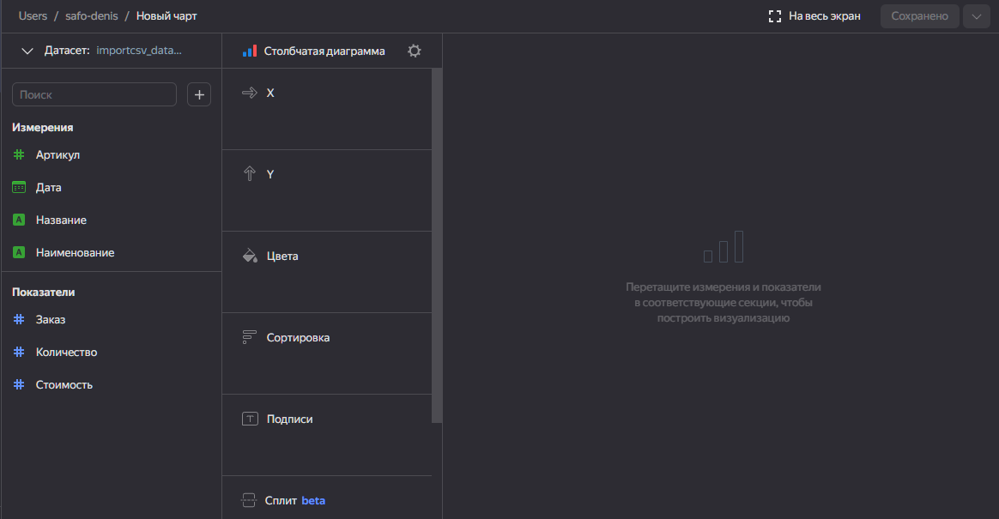

Делаем самый простой чарт. Перетаскиваем из левого поля измерение `Дата` в поле `-> Х`. Перетаскиваем из левого поля измерение `Наименование` в поле `Цвета`.

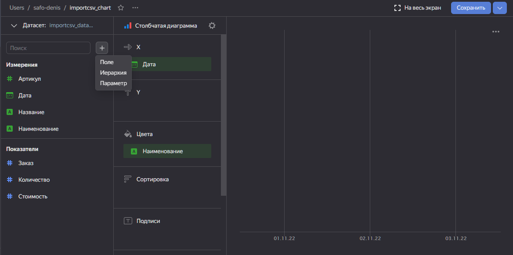

Пока столбцы у нас пустые, надо посчитать выручку по дням. Для этого создадим новый показатель `Выручка`. В левом поле поле возле поиска нажимаем значок `+` и выбираем `Поле`.

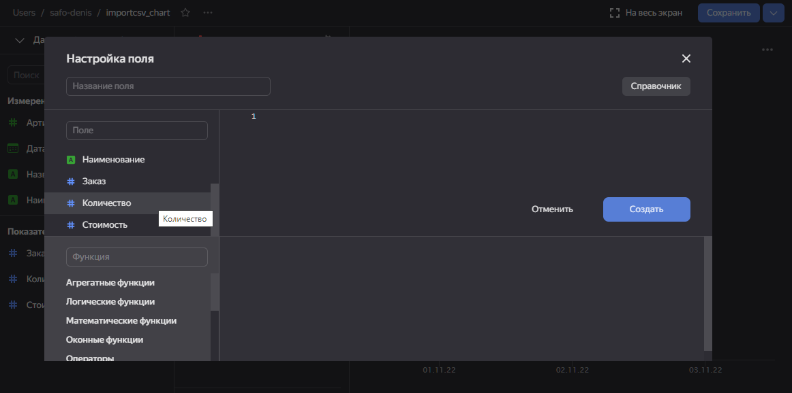

Слева у нас все поля, нажимаем на Количество, поле автоматически вставится в формулу

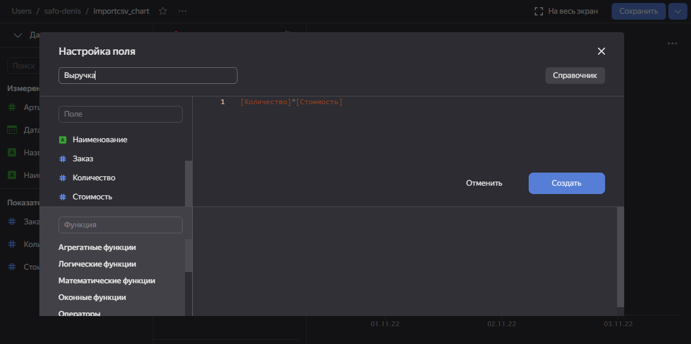

Слева у нас все поля, нажимаем на `Количество`, поле автоматически вставится в формулу. Вводим с клавиатуры символ `*` и нажимаем на на поле `Стоимость`. Мы получили простую формулу где перемножаем количество товара на стоимость единицы товара. В правом верхнем поле `Наименование поля` ввводим название `Выручка`. Нажимаем кнопку `Создать`.

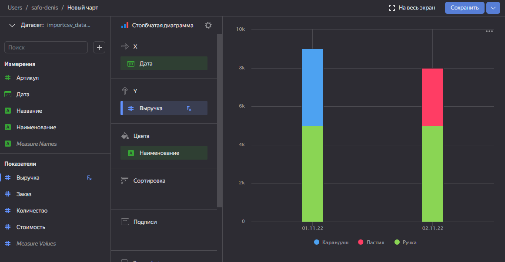

Перетаскиваем из левого поля наш новый показатель `Выручка` в поле `Y`. Теперь у нас появились столбцы, с выручкой по дням и разбивкой по Наименованию. Нажимаем в правом верхнем углу `Сохранить`.

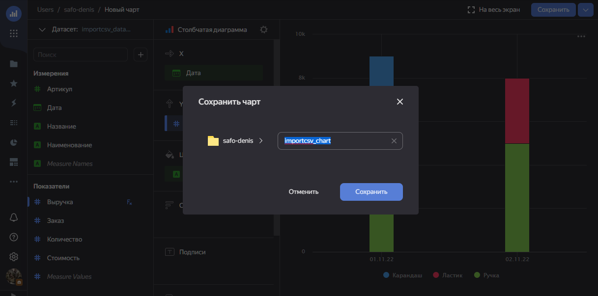

Вводим название чарта. В самом левом столбце с пиктограммами находим Дашборд и нажимаем на него.

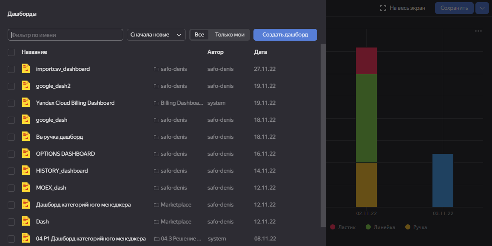

В правом верхнем углу выбираем `Создать дашборд`. Вводим название дашборда.

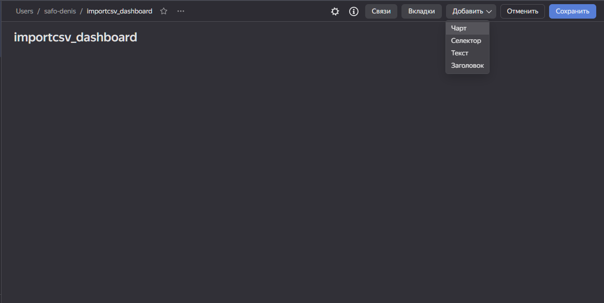

В правом верхнем углу выбираем выпадающий селектор `Добавить` в нем выбираем `Чарт`.

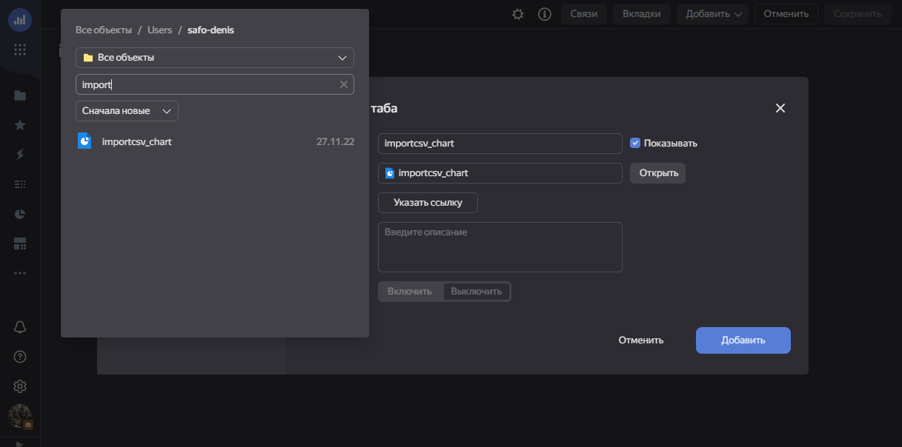

Нажимаем `Чарт` `Выбрать` и в всплывшем окне выбираем чарт, который мы только что создали. В левом нижнем углу нажимаем `Добавить`.

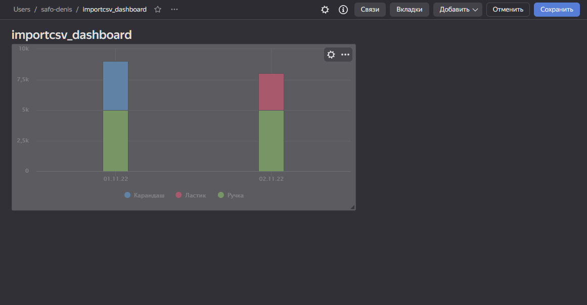

Нажимаем в правом верхнем углу `Сохранить`.

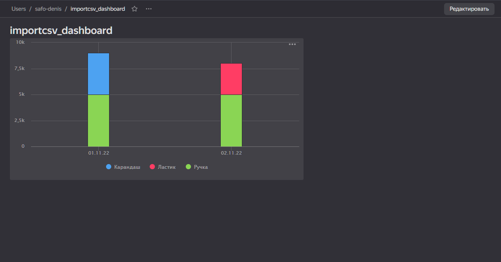

Все мы создали свой дашборд. Теперь изучим его. У нас есть выручка по дням по наименованиям. Но если посмотреть на нашу первую таблицу в Google Sheets, мы увидим, что 

02.11.2022 был заказ на 100 линеек, но в дашборде линеек нет. Это прозошло потому, что у нас во второй таблице в Google Sheets нет Наименования `Линейка`, поэтому, при слиянии двух таблиц, у линейки стоимости нет, соответственно, при вычислении выручка будет 0. Давайте исправим это и проведем обновление нашего дашборда.

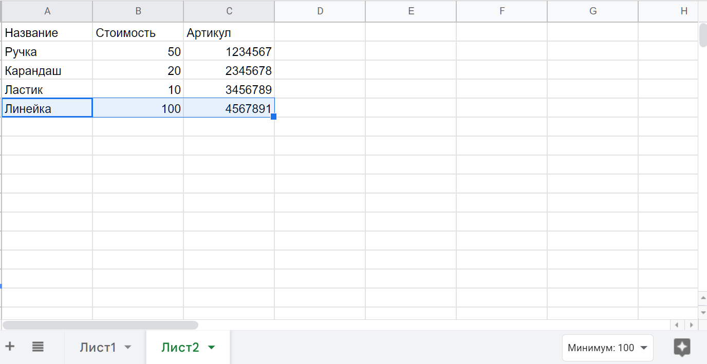

Заходим на Google Sheets в наш документ на второй лист. Добавляем строку со стоимостью для `Линейка`.

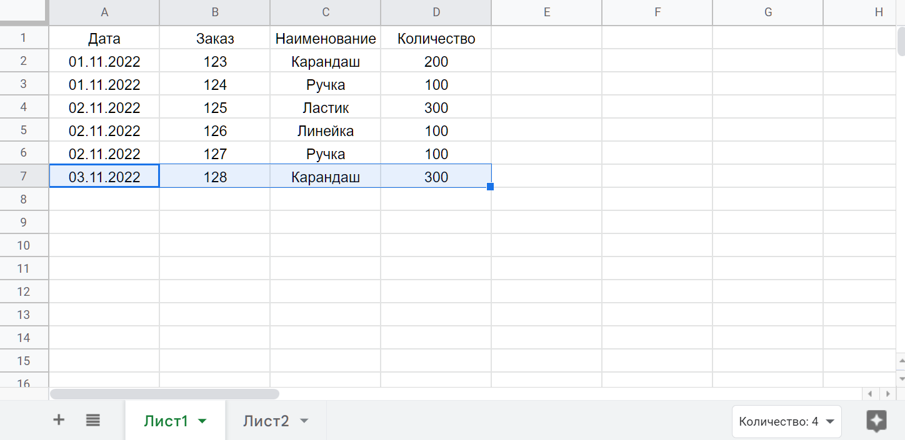

Переходим на первый лист. Добавляем строку `03.11.2022 128 Карандаш 300`. Экспортируем каждый лист в формате CSV на свой жесткий диск.

`Файл` -> `Скачать` -> `Формат CSV (.csv)`. В диалоговом окне сохраняем на жесткий диск. На жестком диске уже есть эти листы, поэтому выбираем их и заменяем.

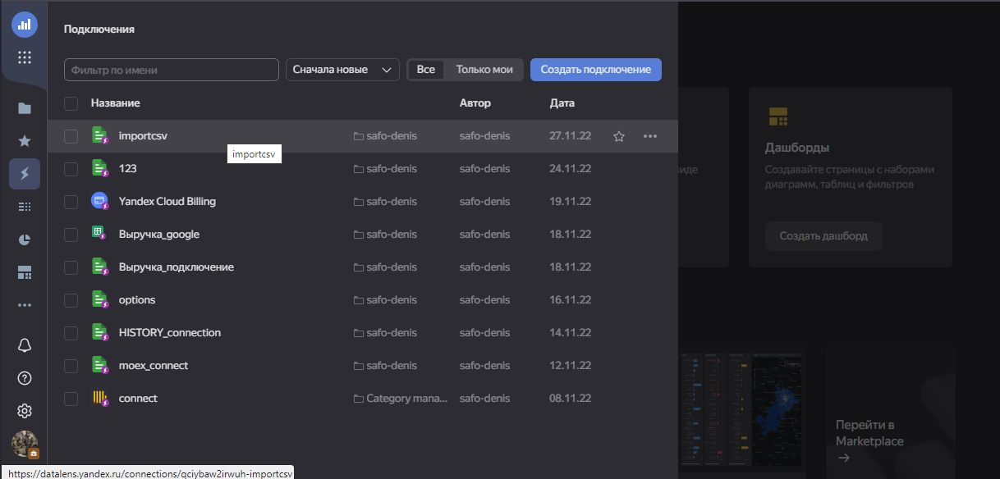

Возвращаемся на [Datalens](https://datalens.yandex.ru). В самом левом столбце с пиктограммами находим `Подключения` и нажимаем на него. В всплывшем окне выбираем наше подключение.

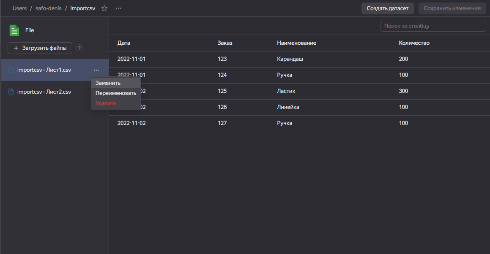

В левом столбце выбираем первый лист и нажимаем на `...` возле него. В менюшке выбираем `Заменить`. В диалоговом окне выбираем csv файл первого листа, который мы только что пересохранили с Google Sheets.

Файл обновился и мы видим, что в левом столбце появились группы Новые файлы и Загруженные ранее. Выбираем второй файл и повторяем операцию обновления.

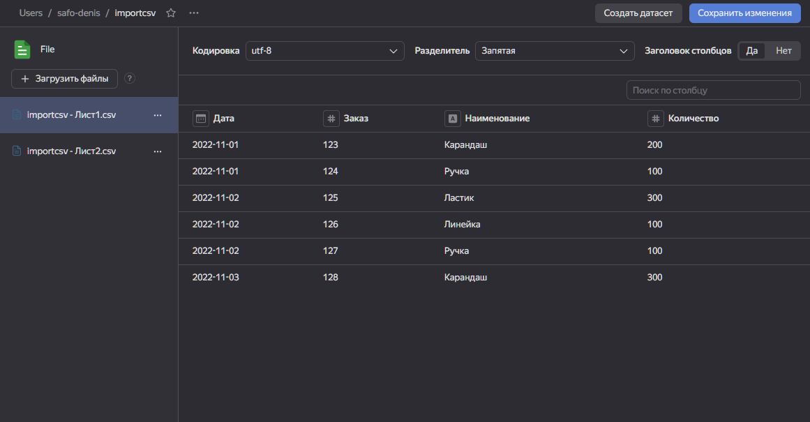

Все файлы обновлены, в предпросмотре справа мы видим, что строк `03.11.2022` появилась. В самом левом столбце с пиктограммами находим `Дашборды` и нажимаем на него (если закрыли вкладку с созданным дашбордом). Выбираем наш дашборд. Если вкладку не закрывали, просто обновите окно браузера (F5).

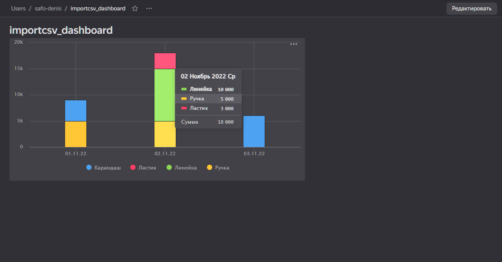

Мы видим, что все, что мы внесли в документе в Google Sheets, теперь у нас в дашборде. Появилась линейка, которая раньше не считалась и заказы от 03.11.2022. По сути, создав дашборд на csv один раз, потом проводим только обновление файлов в подключении.

