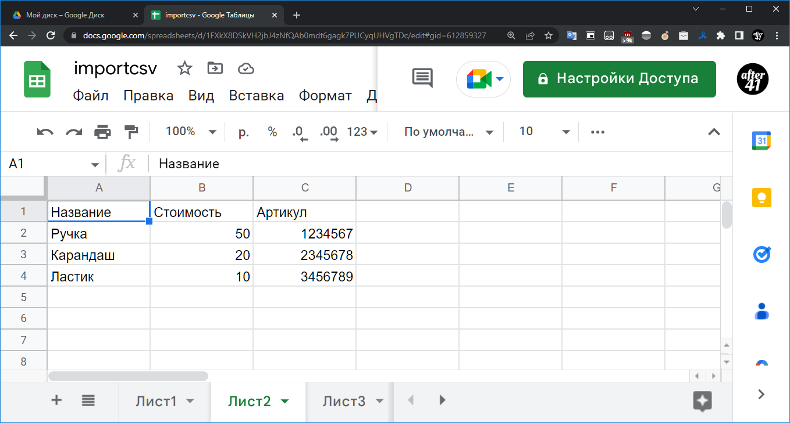
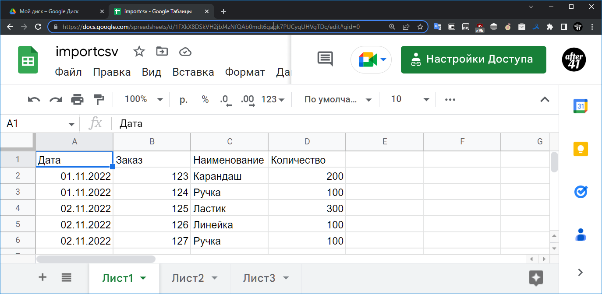
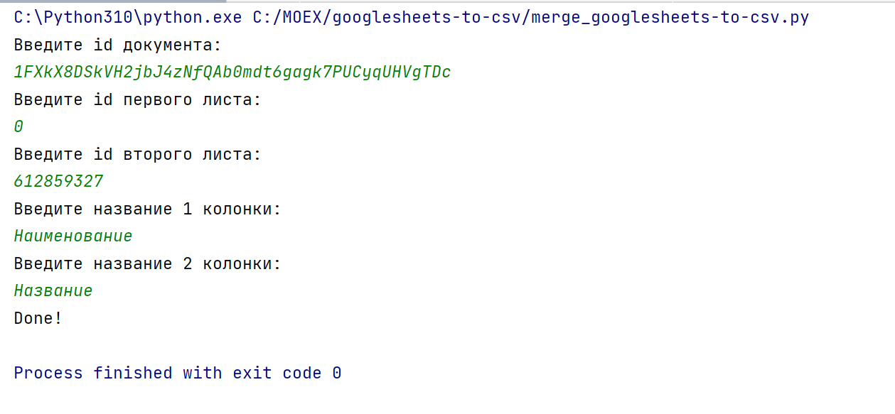

# Объединение двух и более таблиц Google Sheets в csv по ключевым колонкам
## Скрипт на Python для объединения двух и более таблиц Google Sheets в csv по ключевым колонкам.
Скачать таблицу из Google Sheets в формате довольно просто. Тут не нужен API и ключи доступа. А объединить две таблицы по столбцам для Pandas вообще пустяк. Но вот как это сделать непосредственно в Google Sheets или Excel, пока не нашел.

### Подготовка

Для скачивания таблиц из Google Sheets нужно разрешить доступ к Таблице по ссылке. Открываем наш документ.

Нажимаем `Настройки Доступа`

Нажимаем на Доступ ограничен, в появившемся меню выбираем `Все, у кого есть ссылка`. Нажимаем на `Готово`.

Значок на `Настройки Доступа` поменялся с замочка на значок ссылки.

### Установка

Скопируйте файл [merge_googlesheets-to-csv.py](merge_googlesheets-to-csv.py) на жесткий диск.
Запустите удобным способом.

### Применение

Адрес каждого листа Google Sheets выглядит следующим образом: `https://docs.google.com/spreadsheets/d/1FXkX8DSkVH2jbJ4zNfQAb0mdt6gagk7PUCyqUHVgTDc/edit#gid=612859327`, где есть два элемента, которые нам нужны: `https://docs.google.com/spreadsheets/d/<id документа>/edit#gid=<id листа>`. Для вышеприведенного адреса `id документа = 1FXkX8DSkVH2jbJ4zNfQAb0mdt6gagk7PUCyqUHVgTDc`, `id листа = 612859327`. id первого листа всегда равен 0.

В запущенном скрипте вводим по запросам данные.

Названия колонок должно соответствовать своим листам. 
Не обязательно объединять с первым листом, листы могут быть любые.
После выполнения скрипта, в папке со скриптом, появится файл `data.csv` с объединенными таблицами. Можно загружать (обновлять) в DataLens.

Если ничего не поняли (или не знаете Python), но очень надо, обращайтесь в [Телеграм](https://t.me/madby31)

